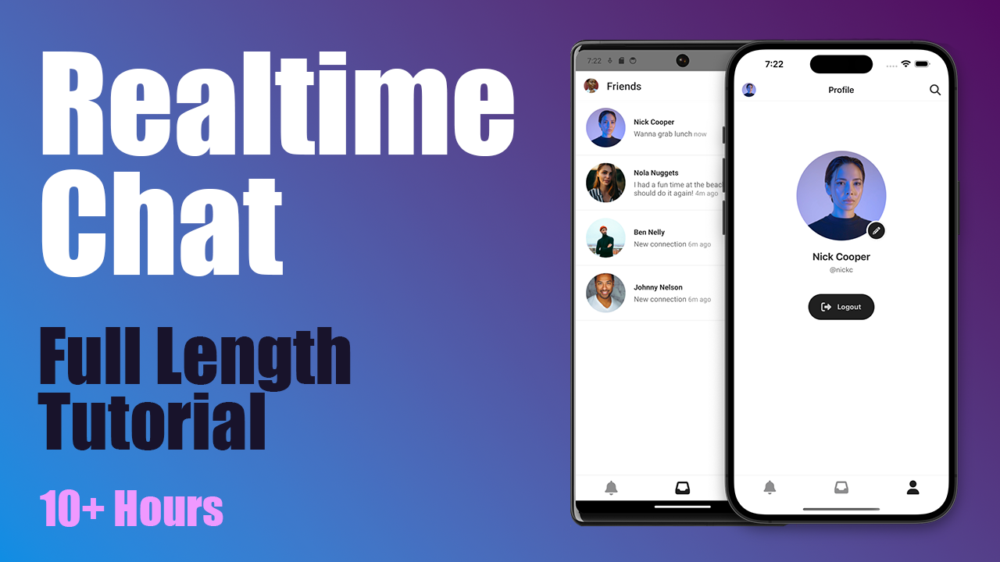

# Realtime Chat

A React Native + Django + Channels real-time communication app tutorial final project.



Youtube playlist link: https://www.youtube.com/playlist?list=PLswiMBSI75YtSVBBKUYY4dC20hQJ7OdAz


## Setup

```
virtualenv -p python3 env
source env/bin/activate
pip install -r requirements.txt
deactivate
cd app
npm install
cd ios
pod install
cd ../..
```

# Run

```
# Terminal 1
make server

# Terminal 2
make redis

# Terminal 3
make
```
